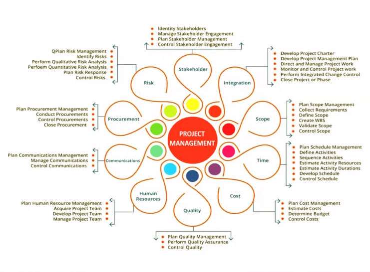
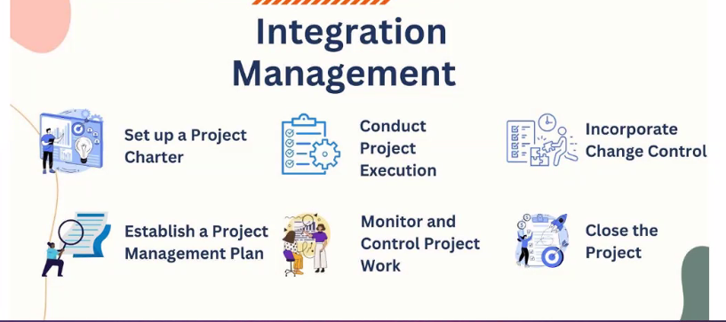

*2024-10-24*

## Project Constraints - bounded inside these limits

- Scope - limit of the system?
- cost - Amount of money for the project, for. every item has a cost.
- Time - Certain duration for the planning.

### Some other constraints

- Resources - Human Resources, No of tables ...,
- Quality - can be subjective requirement, can be no of wheels, color etc...
- Risk - event it can occur negative or positive that can make an impact on the project.need to *mitigate* it. need to have a risk register. there write mitigation strategy.

## Stakeholders

Stakeholder is any person who is effected either postively or negatively by the constraints of the 
project.

negative stakeholder - project brings negative consequences for the stakeholder.

## Project Groups

A process like a machine. Has an input, tools and an output. 

1. Initiation 
2. Planning Stage
3. Executing 
4. Monitoring & Controlling
5. Closing

In each group we produce an artifact. An artifact can be document, file, executables. Artifacts for each of these, 

1. Project Charter (Authority document: project objectives, cost, title, duration - A request for execution), Stakeholder Analysis (Who are stakeholders and list)
2. 
- PMP (project management plan)
- Work breakdown structure (breakdown main component into small components which are easily manageable)
- Schedule (times for activities)
- Budget (Includes costs)
- Plan for all 10 knowledge areas compiled as a one

 3. 
 - Resources (Tangible and intangible resources needed)
 - Tasks (workflows)
 - Deliverables ( outcomes of execution )
 - Managed quality
 - Risk responses
 - Procurements (Any purchases of providers,resources, people ...etc)
 - Stakeholder management
 - Communications (Frequency, mediums ..etc)

4. 
- KPI tracking 
- ?

5. 
?

## Knowledge Areas organize the processes

## Project Integration Management

- Set up a Project Charter
- Conduct Project Execution
- Incorporate Change Control
- Establish a Project / Management Plan
- Monitor and Control Project Work
- Close the Project

### Develop Project Charter

- The very first thing that's done on a new project is the development of the project charter. 
- That's the document that authorizes you to do your work. But you're not always involved in making it
- oftentimes it's handed to you by the sponsor.

### Develop Project Management Plan

- The project management plan is the most important document in the entire PMBOK® Guide. because it guides everything that happens on the project.
- It spans all of the knowledge areas.

### Direct and Manage Project Execution

- After you're done planning, it's time to do the work. 
- Your job is to make sure that everybody is doing what they should be doing, and that the products or services your project creates meet the needs of the stakeholders.

### 

