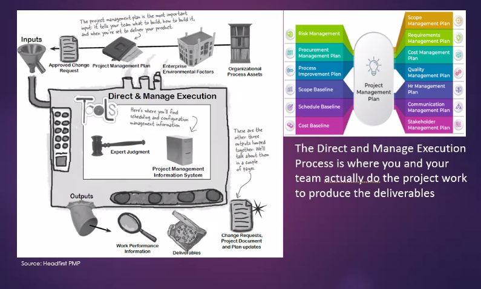
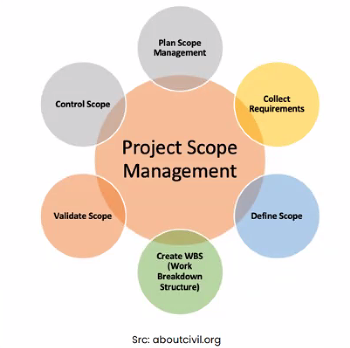
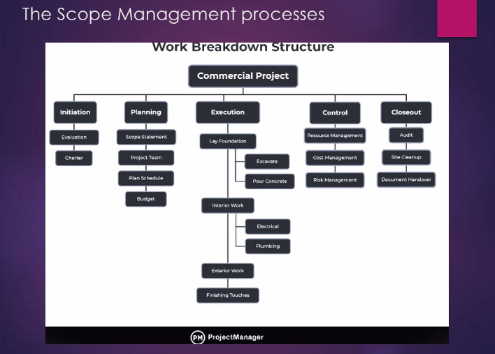

# Direct and Manage Project Execution Process

Headfirst PMP; pm book of knowledge

**Direct and Manage Project Execution Process is where you and your team actually do the project work to produce the deliverables**.

input: Organizational process assets, Enterprise environmental factors, pm plan *, approved changed request

process: project management information system. Expert judgement.

output: work performance information, deliverables, change requests, project document and plan updates

## Project Scope Management: Doing the right stuff

Product scope : the features and functions of the product or service that you and your team are building. 

Project scope : This includes all of the work that needs to be done to make the product.

For ex: Fruit drink, 
product scope: Pineapple, apple...etc.; features and functions that describe the product.
project scope: activites : cut the fruits, apply ingredients
where you trying to create the product.

scope creep: uncontrolled changes that cause the team to do extra work. you specify the scope in scope management plan.

## The Scope management processes

There are five processes

- Collect requirements
- Define scope
- Create WBS
- Control scope
- Verify scope

### Collect requirements

Find all stakeholders reqs. and write them down.    

- Interview
- Focus groups (Eg: Cluster users and get input)
- Faciliated workshops (Eg: A voting workshop that participate lots of people )
    - Unanimity- everyone agrees
    - Majority- > 50%
    - Plurality - gets the most votes
    - Dictatorship - 1 person (eg: CEO decision) 
    (Can be asked for exam)

### Define scope

write down detailed description of the work you'll do and not (out of the scope) and what you'll produce
Create project scope statement (what you do and you don't).

### Create WBS (Work Breakdown Structure)

Organize the all of team work into work packages (discrete pieces of work that team members do).

Eg: Paint house -> paint room1, living room, additional support

This is the most important process because this is where we learn what work needs to be done.

We break the work into phases and decompose the work.
Eg: Wedding: inviting people, creating cake

This creates 3 outputs. WBS, WBS dictionary and the Scope baseline.

### Control Scope

Its important to control changes on the project. Otherwise it'll cause project problems and frustrations. Ex: If customer asks for more, lets go with new budget.

There could be good changes and bad changes. A good change makes the product better with little downside. It doesnt cost more time in schedule/ more money from budget/ doesnt destabilize the product. A bad change, from outside it look like a good idea but imapact on project constraints. It can be scope creep or gold plating.

### Verify Scope

Once the work, you need to make sure that what you are delivering matches your scope statement.

Eg: Paint house-> Once work is complete we have to make sure align with scope statement. Show it to the customer and check.

One tool in this process: Inspection. This is where stakeholders actually look at the what the team did and make sure that every single piece of work was completed.

## Questions

1. What you mean by project scope management?
2. Explain scope management processes by giving your own examples
3. Create a WBS for your wedding project
4. What you mean by a work package? Explain
5. What you mean by gold plating, explain with an example?
6. What is the impact if changes are not controlled in a project?

