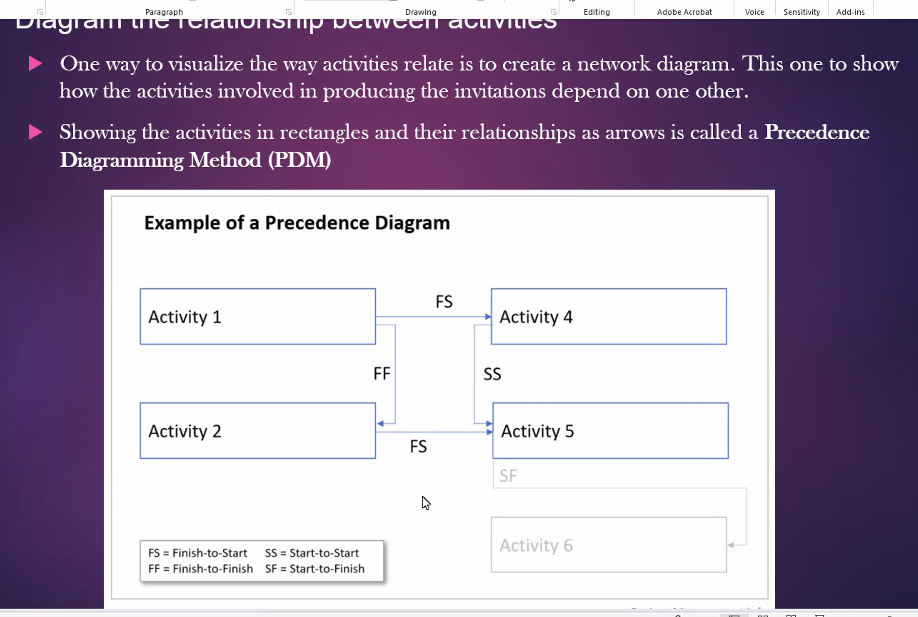
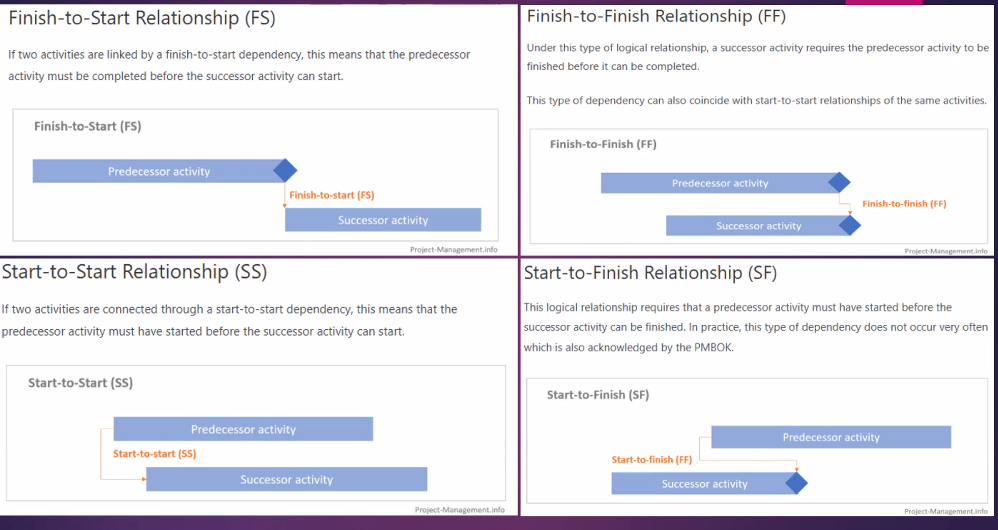
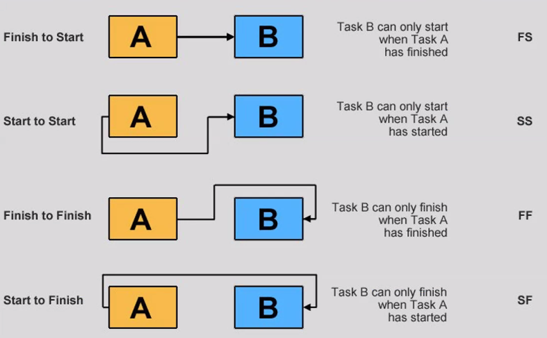
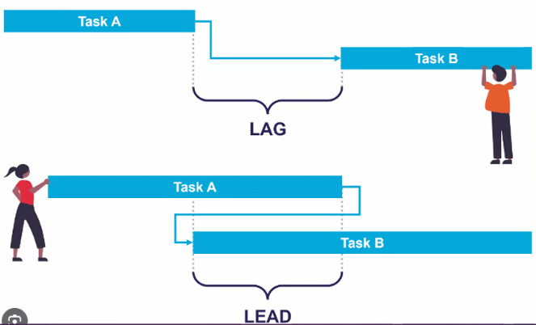

# Time management

**1. Define Activities** - First you come up with a list of all of the activities that will need to be
completed

**2. Sequence Activities**

Next, you figure out which activities need to come before others and put them
in the right order. The main output here is a network diagrami, a picture of how
activities are related

**3. Estimate Activity**

Estimate the resources you'll need to do the job, and create a list of them

**4. Estimate Activity Durations**

Estimate the time it will take to do each activity

**5. Develop Schedule**

Build a schedule from all of the estimates, and the resource and activity information you've created

**6. Control Schedule**

Monitor and control changes to the schedule to make sure that it is kept up to date.

## Diagram the relationship between activities

## Leads and lags add time between activities

Lag time is when you purposefully put a delay between the predecessor task and the
successor. For example, when the bride and her father dance, everybody waits a
while before they join them

Lead time is when you give a successor task some time to get started before the predecessor
finishes. So you might want the caterer preparing dessert an hour before everybody is eating
dinner.

## Estimating the resources

**Expert Judgment** means bringing in experts who have done this sort of work before
and getting their opinions on what resources are needed ..

**Alternatives Analysis** means considering several different options for how you assign
resources. This includes varying the number of resources as well as the kind of resources you
use.

**Published Estimating Data** is something that project managers in a lot of industries
use to help them figure out how many resources they need. They rely on articles, books,
journals, and periodicals that collect, analyze, and publish data from other people's projects.

**Project Management** Software like Microsoft Project will often have features
designed to help project managers play around with resources and constraints and find the
best combination of assignments for the project.

**Bottom-Up Estimating** is a technique that you may have used before
without even knowing it! It means breaking down complex activities into pieces,
and working out the resource assignments for each of those simpler pieces using
the other four tools and techniques.

## Estimation tools and techniques

**Expert Judgment** will come from your project team members who are familiar with the work that has to be done. If you don't get their opinion, then there's a huge risk that your estimates will be wrong!

**Analogous Estimating** is when you look at activities from previous projects that were similar to this one and look at how long it took to do similar work before. But this only works if the activities and the project team are similar!

**Parametric Estimating** means plugging data about your project into a formula, spreadsheet, database, or computer program that comes up with an estimate. The software or
formula that you use for parametric estimating is built on a database of actual durations from past
projects.

**Three-Point Estimates (PERT)** are when you come up with three numbers: a realistic estimate that's most likely to occur, an optimistic one that represents the best-case scenario, and a pessimistic one that represents the worst-case scenario. The final estimate is the average.

**(Optimistic Duration + 4 Most likely Duration + Pessimistic Duration) / 6 = Expected Duration**

**Reserve Analysis** means adding extra time to the schedule (called a contingency reserve or a buffer) to account for extra risk.

**Critical Path Method** is an important tool for keeping your projects on track. Every network diagram has something called the critical path. It's the string of activities that, if you add up all of the durations, is longer than any other path through the network. It usually starts with the first activity in the network and usually ends with the last one.

The reason that the critical path is, well, *critical*, is that every single activity on the path must finish on time in order for the project to come in on time. *A delay in any one of the critical path activities* will cause the **entire project to be delayed**.

Example:

- A (2 days)
- B (3 days)
- C (2 days)
- D (2 days)

B & C can be run parallel.
Critical path = ABD = 7 days

Consider every path, take longest path.

## Questions

- What you mean by activity attributes?
- What is milestone list?
- What you mean by a resource calendar explain.
- What are different estimation techniques explaineach.
- What you mean by critical path method?
- What you mean by float for activities?
- Draw a network diagram for your wedding
- Project and find the critical path. (you may use
activity estimation values as wish)
