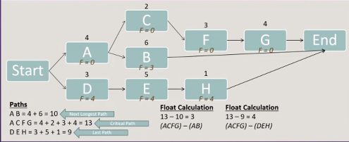
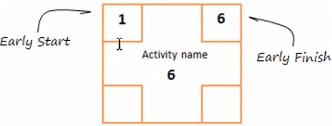
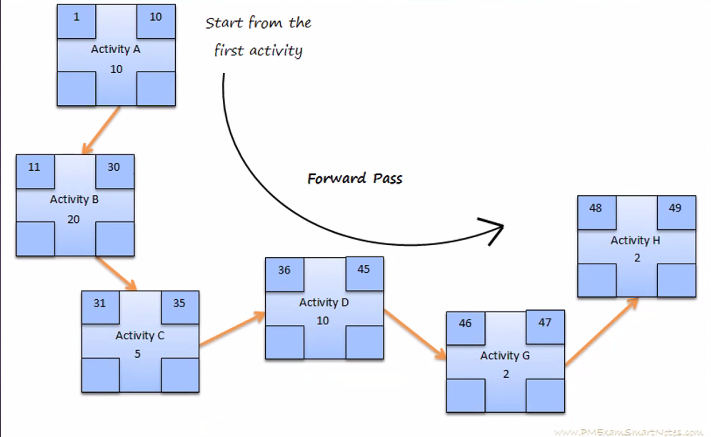
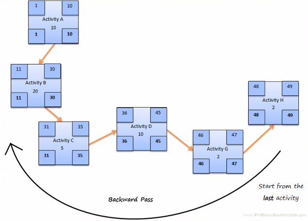
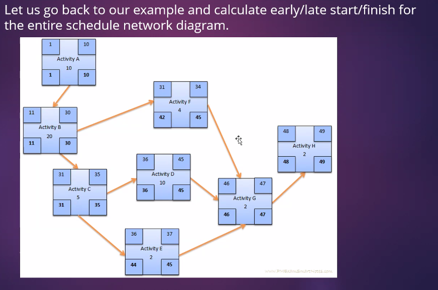

2024-11-14

# Time management

## Float

**The float for any activity is the amount of time that it can slip before it causes your
project to be delayed. You might also see the word "slack" - it's the same thing.**

## Calculation

First you write down the list of all of the paths in the diagram, and you identify the
critical path. **The float for every activity in the critical path is zero.**

Float is calculated by first finding out the critical path and then subtracting it with the next longest
path. The result of this subtraction is the float value for all the activities on the aforementioned path.
Note that float for critical path activities will always be zero even if they are common with the next
longest (or any other) path.

## Diagram the relationships

Calculating Early start and finish (take a FORWARD pass through
network path)

**Remember !: Always start with the critical path and then go with paths with
descending order of their total duration.**

- Step 1: Early start of first activity on critical path is always 1. Write it at the
top left corner of that activity box (see the image below).
- Step 2: Add its activity duration to this early start number and reduce it by
one. Write the resulting number on the top right corner of activity box.
- Step 3: Take the subsequent number of this early finish and write as early
start for next activity. Continue this till you reach the end of critical path.
- Step 4: Select the network path with second highest total duration, and
calculate early starts and finishes. If you find an activity with early start and
finish already written do not overwrite them. Do the same for remaining
network paths.

### Example Forward pass

### Example backward pass

Missing text fill

### Complete passes

## Crashing and Fast Tracking (Schedule Compression)

There are two important schedule compression techniques that you can use to bring in your
project's milestone dates ... but each has its own cost. When you absolutely have to meet the
date and you are running behind, you can sometimes find ways to do activities more quickly
by adding more resources to critical path tasks. That's called **crashing**

Another schedule compression technique is called **fast-tracking**. Sometimes you've got two
activities planned to occur in sequence, but you can actually do them at the same time. On a
software project, you might do both your UAT testing and your functional testing at the same
time, for example. This is pretty risky, though. There's a good chance you might need to
redo some of the work you have done concurrently.

(Also find network diagramming)

# Cost Management

Manging expenses for a project.

## Estimation tools and techniques

- Estimate Costs process: This means figuring out exactly how much you expect each work activity you are doing to
cost. So each activity is estimated for its time and materials cost, and any other
known factors that can be figured in.

- Determine Budget process: Here's where all of the estimates are added up and baselined. Once you have figured out
the baseline, that's what all future expenditures are compared to.
*(Budget means the money that stakeholders give you to do the project).*
*(Baseline means the basic cost for agreed activities at the budget)*

--- 
### Chat gpt baseline 

Q: what is budget baseline in project management
A: 
In project management, a **budget baseline** is the approved version of the project's budget, which includes the total costs and planned expenditures across all project phases and components. It serves as the reference point or standard against which actual performance and expenditures can be measured and tracked throughout the project's lifecycle. The budget baseline typically includes:

1. **Cost estimates** for project resources, materials, labor, equipment, and overheads.
2. **Contingency reserves** for risks and unforeseen events.
3. **Timeline allocations** for when costs are expected to be incurred.

### Key Aspects of a Budget Baseline:
- **Planned vs. Actual Costs:** The budget baseline is used to compare actual project performance against the planned budget. If costs are higher than the baseline, the project manager needs to assess why and take corrective actions.
- **Tracking Progress:** It helps in tracking the financial health of the project, allowing project managers to identify and address any cost overruns or potential savings.
- **Scope and Time Dependencies:** The budget baseline is linked to both the project scope and schedule. A change in scope or timeline can lead to changes in the budget baseline as well.

In practice, the budget baseline can be modified or updated only when there is a formal change request or scope adjustment, ensuring that any variance is properly documented and understood. This ensures that the project remains financially controlled while adapting to any changes.

----

- Control Costs process: This just means tracking the actual work according to the budget to see if any
adjustments need to be made.

## Project Costs: Numbers

- Benefit cost ratio (BCR): This is the amount of money a project is going to make versus how much it will cost to
build it. Generally, if the benefit is higher than the cost, the project is a good
investment.

- Net present value (NPV): This is the actual value at a given time of the project minus all of the costs associated with
it. This includes the time it takes to build it and labor as well as materials. People
calculate this number to see if it's worth doing a project.

- Opportunity cost: When an organization has to choose between two projects, they are always giving up the
money they would have made on the one they don't do. That's called opportunity
cost. It's the money you don't get because you chose not to do a project.

- Internal rate of return: This is the amount of money the project will return to the company that is funding it. It's how
much money a project is making the company. It's usually expressed as a percentage of the
funding that has been allocated to it.

### Output of Costs

1. Activity Cost Estimates

This is the cost estimate for all of the activities in your activity list. It takes into account
resource rates and estimated duration of the activities.

2. Basis of Cost Estimates

Just like the WBS has a WBS Dictionary, and the Activity List has Activity Attributes, the
cost estimate has supporting detail called the Basis of Cost Estimates. Here is
where you list out all of the rates and reasoning you have used to come to the
numbers you are presenting in your estimates.

3. Updates to Project Documents

Along the way, you might find that you need to change the way you measure and manage
cost. These updates allow you to make changes to the Project Management Plan to
deal with those improvements.

4. Requested changes

As you figure out how much the activities will cost, you may realize that the scope or
schedule or risk register or anything else you have baselined needs to change.
When that happens, you need to create a change request and send it through the
change control system.

### Cost management :tools and techniques

1. Earned Value Management

Here's where you measure how your project is doing compared to the plan. This involves using the earned value formulas to assess your project.

2. BAC-Budget At Completion

This is the *first number you think* of when you work on your project costs. It's the **total budget** that you have for your project-how much you plan to spend on your project

3.1. Planned % Complete

If the schedule says that your team should have done 300 hours of work so far, and they will work a total of 1,000 hours on the project, then your Planned % Complete is 30%.
Planned % Complete is easy to work
out as it's just the calculation
Given amount & Total amount

4. Planned Value

This is how much of your budget you planned on using so far. If the BAC is $200,000,
and the schedule says your Planned % Complete is 30%, then the Planned Value is
$200,000×30%=$60,000.

BAC * Planned % Complete = PlannedValue

5. Actual % Complete

Say the schedule says that your team should have done 300 hours of work so far, out of a
total of 1,000. But you talk to your team and find out they actually completed 35% of the
work. That means the actual % complete is 35%.

If your team actually got 35% of the work
done when the schedule says they should only
have gotten 30% done, that means they're
more efficient than you planned!

6. Earned Value 

BAC * Actual % Complete = EarnedValue

