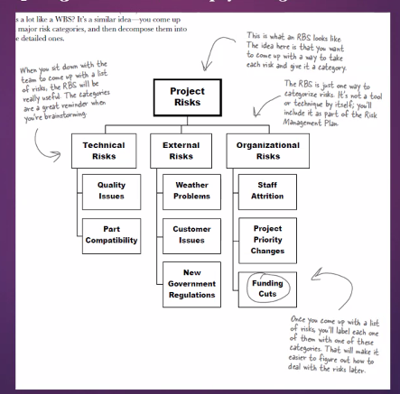
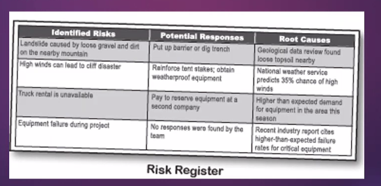
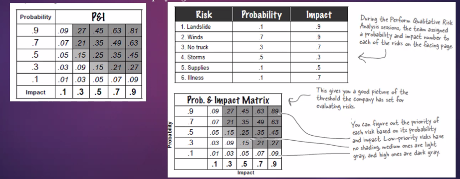
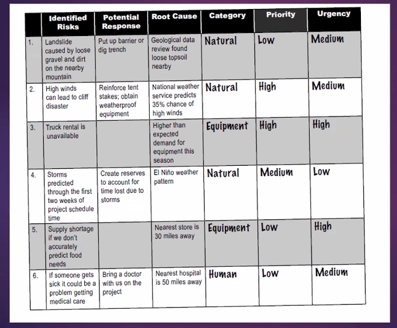
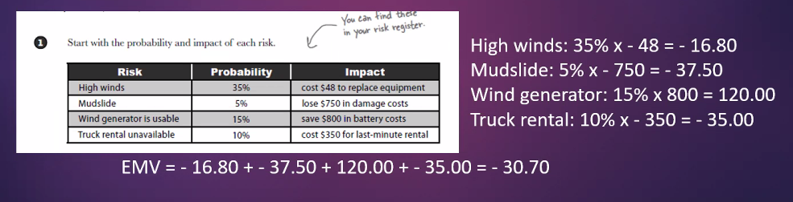

*2024-12-12*

# Project Risk Management

Even the most carefully planned project can run into trouble. No matter how well you plan, your project can always run into unexpected problems.

Team members get sick or quit, resources that you were depending on turn out to be unavailable
eg: even the weather can throw you for a loop. So does that mean that

## What is a risk?

Any time there's anything that might occur on your project and change the outcome of a project activity, we call that a risk. A risk can be an event (like a fire), or it can be a condition (like an important part being unavailable). Either way, it's something that may or may not happen ... but if it does, then it will force you to change the way you and your team
will work on the project.

A risk is any uncertain event or condition that might affect your project. Not all risks are
negative. 
- eg: Some events (like finding an easier way to do an activity) or conditions (like lower prices for
certain materials) can help your project! When this happens, we call it an
opportunity ... but it's still handled just like a risk.

## How you deal with risk?

**Avoid** : The best thing that you can do with a risk is avoid it-if you can prevent it from happening, it definitely won't hurt your project.

**Mitigate** : If you can't avoid the risk, you can mitigate it. This means taking some sort of action that will cause it to do as little damage to your project as possible.

**Transfer** : One effective way to deal with a risk is to pay someone else to accept it for you. The most common way to do this is to buy insurance.

**Accept** : When you can't avoid, mitigate, or transfer a risk, then you have to accept it. But even when you accept a risk, at least you've looked at the  alternatives and you know what will happen if it occurs.

## Risk Management Plan

Risk Breakdown Structure (RBS) here. It's a great tool for 
managing your risk categories. It looks like a WBS, except 
instead of tasks it shows how the risks break down into categories.

Probability and impact guidelines to help you figure out 
how big a risk's impact is.

## Anatomy of a risk

- Identify Risks: The first thing you need to do when planning for risks is to gather the team
together and come up with a list of every possible risk you can think of.
-   Perform Qualitative Risk Analysis: Once you've got a list of risks, you'll need to get a good idea of
the probability and impact of each risk.

All four of these Risk Management processes are in the Planning process group-you
need to plan for your project's risks before you start executing the project.

The goal of all of the risk planning processes is to produce the risk register. That's
your main weapon against risk.

## Information-gathering techniques for Identify Risks

Brainstorming is the first thing you should do with your team. Get them all together in a
room, and start pumping out ideas. Brainstorming sessions always have a facilitator to lead
the team and help turn their ideas into a list of risks.

Interviews are a really important part of identifying risk. Try to find everyone who might
have an opinion and ask them about what could cause trouble on the project. The sponsor or
client will think about the project in a very different way than the project team.

The Delphi technique is a way to get opinions and ideas from experts. This is another
technique that uses a facilitator, but instead of gathering team members in a room, they send
questionnaires to experts asking about important project risks. The facilitator will take those
answers and circulate them all to the experts-but each expert is kept anonymous so that they
can give honest feedback.

Root cause identification is analyzing each risk and figuring out what's actually behind
it. Even though falling off of the cliff and having your tent blow away are two separate risks,
when you take a closer look you might find that they're both caused by the same thing: high
winds, which is the root cause for both of them. So you know that if you get high winds, you
need to be on the lookout for both risks!

## Examine each risk in the register

Perform Qualitative Risk Analysis helps you prioritize each risk and figure out its
probability and impact.

One of the best ways to be sure that you're handling your risks properly is to examine how likely they
are to happen, and how bad (or good) it will be if they do. This process helps you assign a probability
to the likelihood of a risk occurring, and then figure out the actual cost (or impact) if it does happen.
You can use these values to figure out which of your risks need a pretty solid mitigation plan, and
which can monitored as the project goes on.

**Perform Quantitative Risk Analysis** : Once you've identified risks and ranked them
according to the team's assessment, you need to take your analysis a little further and
make sure that the numbers back you up. Sometimes you'll find that your initial
assessment needs to be updated when you look into it further.

**Calculate the Expected Monetary Value of your risks**: you know the probability and
impact of each risk. How does that really help you plan? Well, it turns out that if you
have good numbers for those things, you can actually figure out how much those risks
are going to cost your project. You can do that by calculating the Expected Monetary
Value (or EMV) of each risk:

## How do you respond to a risk?

Your risk register should include both threats and opportunities. Opportunities have
positive impact values, while threats have negative ones. Don't forget the plus or minus
sign when you're calculating EMV

- **Exploit** This is when you do everything you can to make sure that you take advantage of an
opportunity. You could assign your best resources to it. Or you could allocate more than enough
funds to be sure that you get the most out of it.

- **Share** Sometimes it's harder to take advantage of an opportunity on your own. Then you might
call in another company to share in it with you.

- **Enhance** This is when you try to make the opportunity more probable by influencing its triggers.
If getting a picture of a rare bird is important, then you might bring more food that it's attracted to.

- **Accept** Just like accepting a negative risk, sometimes an opportunity just falls in your lap. The best
thing to do in that case is to just accept it!