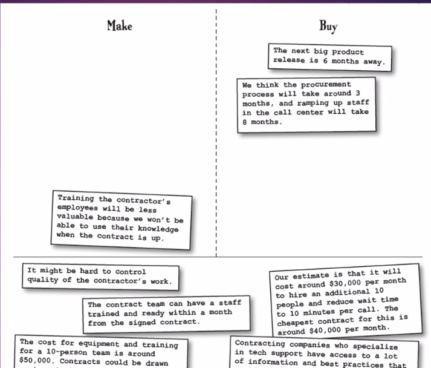
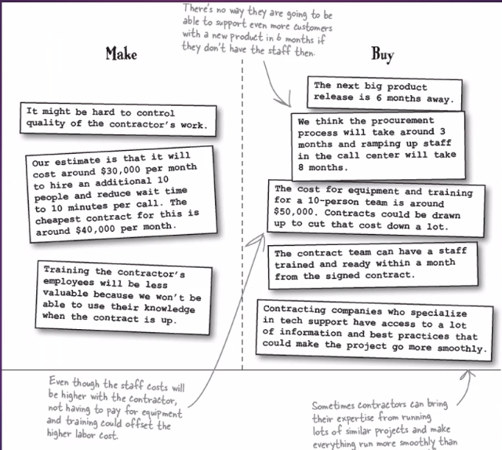

# Project Procurement management

Sometimes you need to hire an outside company to dosome of your project work. That's called procurement, and the outside company is called the seller.

## Procurement Management processes

**Plan Procurements**:  Here's where you take a close look at your needs, to be sure that you
really need to create a contract. You figure out what kinds of contracts make sense for your
project, and you try to define all of the parts of your project that will be contracted out. You'll
need to plan out each individual contract for the project work and work out how you'll
manage it. That means figuring out what metrics it will need to meet to be considered
successful, how you'll pick a seller, and how you'll administer the contract once the work is
happening.

**Conduct Procurements**: This process is all about getting the word out to potential contract
partners about the project and how they can help you. You hold bidder conferences and find
qualified sellers that can do the work. Next, you evaluate all of the responses to your
procurement documents and find the seller that suits your needs the best. When you find
them, you sign the contract, and then the work can begin.

**Administer Procurements**:  When the contract is underway, you stay on top of the
work and make sure the contract is adhered to. You monitor what the contractor is
producing and make sure everything is running smoothly. Occasionally, you'll need
to make changes to the contract. Here's where you'll find and request those
changes.

**Close Procurements**: When the work is done, you'll close your contract out. You'll make
sure that the product that is produced meets the criteria for the contract, and that the
contractor gets paid.

**Make or buy analysis** means figuring out whether or not you should be contracting
the work or doing it yourself. It could also mean deciding whether to build your own
solution to your problem or buy one that is already available. Most of the same factors
that help you make every other major project decision will help you with this one.

- How much does it cost to build it versus buy it?
- How will this decision affect the scope of your project?
- How about your project schedule?

- Do you have time to do the work and still meet your commitments?

- As you plan out what you will and won't contract, you need to have thought
through your reasoning pretty carefully. There are some resources (like heavy
equipment) that your company can buy, rent, or lease depending on the situation.
You'll need to examine leasing versus buying costs and determine the best way to
go forward.

(Exam q)
**Contract types**: You should know a little bit about the major kinds of contracts
available to you so that you choose the one that creates the most fair and workable deal
for you and the contractor. Some contracts are

- Fixed Price: no matter how much time or effort goes into them, you always pay the
same.

- Some are Cost Reimbursable- sometimes called Cost Plus-where the seller charges
you for the cost of doing the work plus some fee or rate. The

- Third major kind of contract is Time and Materials. That's where the buyer pays a rate
for the time spent working on the project and also pays for all of the materials used to
do the work.

## Types of contracts detailed

### 1. Fixed price contracts

**Fixed price (FP)** means that you are going to pay one amount regardless of how much it
costs the contractor to do the work. A fixed price contract only makes sense in cases where
the scope is very well known. If there are any changes to the amount of work to be done, the
seller doesn't get paid any more to do it.

**Fixed price plus incentive fee (FPIF)** means that you are going to pay a fixed price for the
contract and give a bonus based on some performance goal. You might set up a contract
where the team **gets a $50,000 bonus if they manage to deliver an acceptable product before
the contracted date**. If the fixed-price contract does not include a fee, it's often referred to as
*a firm fixed price (FFP)* contract.

### 2. Cost-reimbursable contracts 

**Costs plus fixed fee (CPFF)** means what it says. You pay the seller back for the costs
involved in doing the work, plus you agree to an amount that you will pay on top of that.

**Costs plus award fee (CPAF)** is similar to the CPFF contract, except that instead of paying
a fee on top of the costs, you agree to pay a fee based on the buyer's evaluation of
the seller's performance.

**Costs plus incentive fee (CPIF)** means you'll reimburse costs on the project and pay a fee
if some performance goals are met. Kate could set up her project using this contract type by
suggesting that the team will get a $50,000 bonus if they keep the average wait time for the
calls down to seven minutes per customer for over a month. If she were on a CPIF contract,
she would pay the team their costs for doing the work, and also the a $50,000 bonus when
they met that goal.

### 3. Time and Materials

**Time and Materials (T&M)** is used in labor contracts. It means that you will pay a rate for
each of the people working on your project plus their materials costs. The "Time" part
means that the buyer pays a fixed rate for labor-usually a certain number of dollars per hour.
And the "Materials" part means that the buyer also pays for materials, equipment, office
space, administrative overhead costs, and anything else that has to be paid for. The seller
typically purchases those things and bills the buyer for them. This is a really good contract to
use if you don't know exactly how long your contract will last, because it protects both the
buyer and seller.

### More about contracts

#### Figure out how you'll sort out potential sellers

- There are a bunch of different documents you might want to send to sellers who
want to bid on your work. You'll usually include the **contract statement of work (SOW)** so
that sellers know exactly what work is involved.

- An **invitation for bid (IFB)** is a document that tells sellers that you want them to submit
proposals. You'll also hear of people using **requests for information (RFI)** and
**requests for proposals (RFP)**.

- There's another kind of invitation-an **invitation for quote (IFQ)**. This is a way to tell sellers
that you want them to give you a quote on a fixed-price contract to do the work.

- A purchase order is something you'll send out to a seller who you know that you want to
work with. It's an agreement to pay for certain goods or services.

#### Decide in advance on how you want to select the sellers. 

There are a lot of ways you can select a potential seller. Figuring out if a seller is appropriate for your
work is something that takes a lot of talking and thinking-and there's no single,
one-size-fits-all way of selecting sellers. But there are some things that you should
definitely look for in any seller:

- Can the seller actually do the work you need done?
Howv much will the seller charge?

- Can the seller cover any costs and expenses necessary to do the job?

- Are there subcontractors involved that you need to know about?

- Does the seller really understand everything in the SOW and contract?

- Is the seller's project management capability up to the task?

#### Pick a partner

You've figured out what services you want to procure, and you've gone out
and found a list of potential sellers. Now it's time to choose one of them to do the project
work-and that's exactly what you do in Conduct Procurements

- Internet Search: Companies will often use an Internet search to get in idea of the price range for
the things they'll need to buy as part of the proposal. The more complex the procurement process,
though, the less helpful this tool is.

- **Advertising**: Sometimes the best way to get in touch with sellers is to place an ad. Also, sometimes
you are required to take out an ad (like for some government-funded projects) in order to give all
sellers full notice.

- **Independent Estimates** A lot of the time, you don't have the expertise in your company to figure
out whether or not a seller is quoting you a fair price. That's why you'll often turn to a third party to
come up with an estimate of what the work should cost.

- **Bidder Conferences**: It's really important that you make sure all of the bidders can compete in a
fair, unbiased way. And the best way to do that is to get them all in a room together, so that they can
ask questions about your contract. That way you don't give any one seller an advantage by providing
inside information that the other sellers don't have access to.

- **Expert Judgment**: Here's another case where it's really good to bring in someone from outside
your project to help evaluate each proposal. You should bring in someone with a lot of specific
expertise in the work being done to make sure the seller is up to the job.