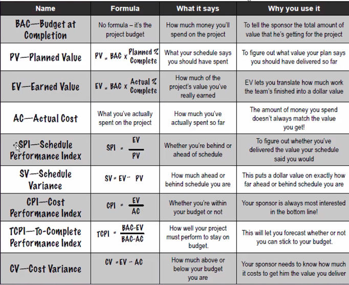

*2024-11-15*

# Cost Management

## Is your project behind or ahead of schedule ?:

- Schedule Performance Index (SPI) : 

If you want to know whether you're ahead of or behind
schedule, use SPIs. The key to using this is that when you're ahead of schedule,
you've earned more value than planned! So EV will be bigger than PV. To work
out your SPI, you just divide your EV by your PV.

$ SPI = EV/PV $

If SPI is greater than
one, that means EV is
bigger than PVi so you're
ahead of schedule!

If SPI is less than one, then youire
behind schedule because the amount
you've actually worked (EV) is less
than what you'd plaraed (PV/)

- Schedule Variance (SV): 

It's easy to see how variance works. The bigger the difference
between what you planned and what you actually carned, the bigger the variance.
So, if you want to know how much ahead or behind schedule you are, just subtract
PV from EV.

Remember, for the sponsor's benctit.
we measure this in dollars ...

so if the variance is positive, it tells
you exactly how may dollars you've
ahead If it's negative, it tells you how
many dollars you're behind.

$ SV = EV - PV $

## Are you over budget?

- Cost Performance Index (CPI) : 

If you want to know whether you're over or under
budget, use CPI.

$ CPI = EV/AC $

CPI is greater than or equal to 1 and CV is positive. When this happens, your actual
costs are less than Earned Value, which means the project is delivering more
value than it costs

- Cost Variance (CV) : 

This tells you the difference between what you planned on
spending and what you actually spent. So, if you want to know how much under or
over budget you are, just take AC away from EV.

$ CV = EV - AC $ ( AC - Actual cost?)

Remember what CV means to the sponsor
EV says how much of the total value of
the project has been earned back so far.
If CV is negative, then he's not getting
good value for his money-

- To-Complete Performance Index (TCPI):

This tells you how well your project will need
to perform to stay on budget.

$ TCPI = (BAC-EV) / (BAC-AC) $

### Questions

You're managing a project to install 200 windows in a new skyscraper and need to figure out your
budget. Each week of the project costs the same: your team members are paid a total of $4,000 every
week, and you need $1,000 worth of parts each week to do the work. If the project is scheduled to last
16 weeks, what's the BAC for the project?

- What will the Planned % Complete be four weeks into the project?

- What should the PV be four weeks into the project?

- You've checked with your team, but they have bad news. The schedule says they were supposed to
have installed 50 windows by now, but they only installed 40. Can you figure out the actual %
complete?

- What should the Earned Value be right now?