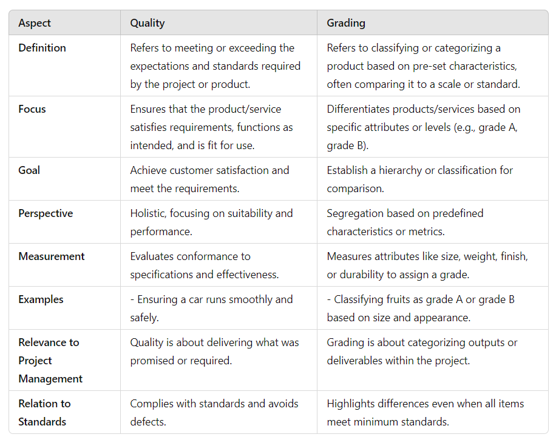
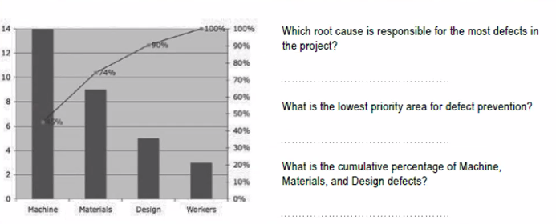
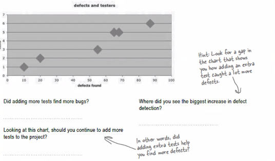

*2024-11-15*

# Cost Management

## Is your project behind or ahead of schedule ?:

- Schedule Performance Index (SPI) : 

If you want to know whether you're ahead of or behind
schedule, use SPIs. The key to using this is that when you're ahead of schedule,
you've earned more value than planned! So EV will be bigger than PV. To work
out your SPI, you just divide your EV by your PV.

$SPI = \frac{EV}{PV}$

If SPI is greater than
one, that means EV is
bigger than PVi so you're
ahead of schedule!

If SPI is less than one, then youire
behind schedule because the amount
you've actually worked (EV) is less
than what you'd plaraed (PV/)

- Schedule Variance (SV): 

It's easy to see how variance works. The bigger the difference
between what you planned and what you actually carned, the bigger the variance.
So, if you want to know how much ahead or behind schedule you are, just subtract
PV from EV.

Remember, for the sponsor's benctit.
we measure this in dollars ...

so if the variance is positive, it tells
you exactly how may dollars you've
ahead If it's negative, it tells you how
many dollars you're behind.

$SV = EV - PV$

## Are you over budget?

- Cost Performance Index (CPI) : 

If you want to know whether you're over or under
budget, use CPI.

$CPI = \frac{EV}{AC} $

CPI is greater than or equal to 1 and CV is positive. When this happens, your actual
costs are less than Earned Value, which means the project is delivering more
value than it costs

- Cost Variance (CV) : 

This tells you the difference between what you planned on
spending and what you actually spent. So, if you want to know how much under or
over budget you are, just take AC away from EV.

$CV = EV - AC$ ( AC - Actual cost?)

Remember what CV means to the sponsor
EV says how much of the total value of
the project has been earned back so far.
If CV is negative, then he's not getting
good value for his money-

- To-Complete Performance Index (TCPI):

This tells you how well your project will need
to perform to stay on budget.

$TCPI = \frac{(BAC-EV)}{(BAC-AC)}$

### Questions

You're managing a project to install 200 windows in a new skyscraper and need to figure out your
budget. Each week of the project costs the same: your team members are paid a total of $4,000 every
week, and you need $1,000 worth of parts each week to do the work. If the project is scheduled to last
16 weeks, what's the BAC for the project?

- What will the Planned % Complete be four weeks into the project?

- What should the PV be four weeks into the project?

- You've checked with your team, but they have bad news. The schedule says they were supposed to
have installed 50 windows by now, but they only installed 40. Can you figure out the actual %
complete?

- What should the Earned Value be right now?

# Quality Management

## What is Quality?

**Quality is the measurement of how closely your product meets its requirements.**

- **Customer satisfaction** is about making sure that the people who are paying for the
end product are happy with what they get. When the team gathers requirements for the
specification, they try to write down all of the things that the customers want in the
product so that you know how to make them happy. Some requirements can be left
unstated, too. Those are the ones that are implied by the customer's explicit needs. In
the end, if you fulfill all of your requirements, your customers should be really satisfied.

- **Fitness for use** is about making sure that the product you build has the best design
possible to fit the customer's needs. Which would you choose: a product that's
beautifully designed, well constructed, solidly built, and all-around pleasant to look at
but does not do what you need, or a product that does what you want despite being
really ugly to look at and a pain in the butt to work with? You'll always choose the
product that fits your needs, even if it's seriously limited. That's why it's important that
the product both does what it is supposed to do and does it well.

- **Conformance to requirements** is the core of **both customer satisfaction and fitness**
for use. Above all, your product needs to do what you wrote down in your
requirements specification. Your requirements should take into account both what will

## Quality vs. grade

You can eat a lobster platter for dinner, or you can eat a hot dog. They are both types of
food, right? But they have very different tastes, looks, feels, and most importantly, cost. If you
order the lobster in a restaurant, you'll be charged a lot more than if you order a hot dog. But
that doesn't mean the lobster is a higher-quality meal. If you'd ordered a salad and got lobster
or a hot dog instead, you wouldn't be satisfied.

chatgpt:

Key Takeaways:
Quality ensures that the product/service is fit for use and meets requirements, while grading compares items and categorizes them based on their attributes.
A high-grade item may not necessarily have high quality if it doesn't meet intended use, and vice versa.

## Quality Management processes (3 processes)

**Plan Quality** is like the other planning processes you've learned about-you create a
Quality Management Plan to help guide you and your team through quality
activities.

**Perform Quality Control** is the Monitoring & Controlling process where you look at
each deliverable and inspect it for defects.

**Perform Quality Assurance** is where you take a step back and look at how well
your project fits in with your company's overall quality standards and guidelines.

When it comes to defects, prevention is always better than inspection!

## How to plan for quality

- **Cost-benefit analysis** -is looking at how much your quality activities will cost versus how
much you will gain from doing them. The costs are easy to measure; the effort and
resources it takes to do them are just like any other task on your schedule. Since
quality activities don't actually produce a product, though, it is harder for people to
measure the benefits sometimes. The main benefits are less rework, higher
productivity and efficiency, and more satisfaction

- **Benchmarking** - means using the results of Plan Quality on other projects to set goals for
your own. You might find that the last project your company did had 20% fewer
defects than the one before it. You would want to learn from a project like that and
put in practice any of the ideas they used to make such a great improvement.
Benchmarks can give you some reference points for judging your own project
before you even get started with the work.

- **Design of experiments** - is where you apply the scientific method to create a set of
tests for your project's deliverables. It's a statistical method, which means you use
statistics to analyze the results of your experiments to determine how your
deliverables best meet the requirements. A lot of quality managers use this
technique to produce a list of tests that they'll run on the deliverables, so they have
data to analyze later.

## How to plan for quality

- **Flowcharting** means coming up with a graphical depiction of the the process you're doing so
that you can anticipate where quality activities might help you prevent defects.

- **Control charts** are used to figure out which processes in your company might be having
quality problems. They're used for measuring the performance of activities that are done
over and over.

- **Properietary techniques** are process frameworks and methodologies that project
managers use to improve quality.

- **Cost of quality** is what you get when you add up the cost of all of the prevention and
inspection activities you are going to do on your project. It doesn't just include the testing. It
includes any time spent writing standards, reviewing documents, meeting to analyze the root
causes of defects, rework to fix the defects once they're found by the team-absolutely
everything you do to ensure quality on the project.

- **Statistical sampling** is when you look at a representative sample of something to make
decisions. For example, you might take a look at a selection of widgets produced in a factory
to figure out which quality activites would help you prevent defects in them.

Note : The Quality Management Plan is the main tool for preventing defects on your
project.

## Questions

1. Machines
2. Workers
3. 90%

